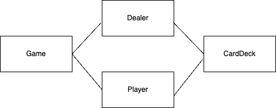

# 블랙잭 게임 만들기

https://okky.kr/questions/358197

위 글을 읽고 객체지향 프로그래밍 연습을 위해 블랙잭 게임을 만들어보게 되었습니다. 챗 지피티에게 블랙잭 룰을 물어보았고 다음과 같이 정리했습니다.

```
Blackjack Game

1️⃣ 게임 기본 요구사항
✅ 카드 관련
- 카드 덱(Deck)은 52장의 카드(4개의 문양 × 13개의 값)로 구성된다.
- 카드는 랜덤하게 섞인 상태에서 게임이 시작될 때 사용된다.
- 각 카드는 특정 값(A=1, J/Q/K=10, 숫자=해당 숫자)을 가진다.
✅ 게임 시작
- 게임이 시작되면 딜러와 플레이어는 각각 2장의 카드를 받는다.
- 플레이어의 카드는 공개되며, 딜러의 카드는 1장만 공개되고 나머지 1장은 숨겨진다.
- 만약 처음 받은 2장의 카드 합이 21(블랙잭) 이면 즉시 승패가 결정된다.
    - 플레이어가 블랙잭이면 승리 (단, 딜러도 블랙잭이면 무승부)
    - 딜러가 블랙잭이고 플레이어가 블랙잭이 아니면 패배

2️⃣ 플레이어 행동 요구사항

✅ 카드 추가 요청 (Hit)
- 플레이어는 원하는 만큼 카드를 추가(Hit)할 수 있다.
- 하지만 카드 합이 21을 초과하면(Bust) 즉시 패배한다.
✅ 카드 유지 (Stand)
- 플레이어는 원하는 순간에 카드 받기를 멈출 수 있다(Stand).

3️⃣ 딜러 행동 요구사항
✅ 딜러의 카드 추가 규칙
- 모든 플레이어가 카드 추가(Hit) 또는 멈추기(Stand)를 결정한 후, 딜러의 숨겨진 카드(홀 카드)를 공개한다.
- 딜러는 16 이하의 점수일 경우 반드시 카드 한 장을 추가해야 한다.
- 딜러는 17 이상의 점수일 경우 추가 카드 없이 멈춘다.
- 딜러도 21을 초과하면(Bust) 즉시 패배하며, 플레이어가 남아 있으면 승리한다.

4️⃣ 승패 판정 요구사항
✅ 일반 승패 판정
- 플레이어가 딜러보다 높은 점수이면 승리한다.
- 플레이어와 딜러의 점수가 같으면 무승부(Push) 로 처리된다.
- 플레이어 점수가 21을 초과하면 즉시 패배하며, 딜러의 추가 행동 없이 종료된다.
✅ 블랙잭 승리 보너스
- 플레이어가 블랙잭(2장의 카드로 21)이고, 딜러는 블랙잭이 아닐 경우 배팅금의 1.5배를 받는다.
```

원래 ‘A’ 카드는 1 또는 11이 되지만 편의를 위해 1로 고정한 채 개발하기로 결정했습니다.

## 모델링

개발전 간단하게 모델링을 해보았습니다. 다음과 같습니다.


Game 객체는 블랙잭 게임의 순서를 진행하는 역할을 맡았습니다. Dealer와 Player는 각각 딜러와 플레이어를 추상화 했습니다. 두 객체 모두 딜러와 플레이어가 카드를 다루는 일을 하는 책임을 할당받았습니다. 카드 덱은 카드를 모아두고 요청에 따라 카드를 섞고 카드를 건네주는 역할을 하고 있습니다.

## 코드로 살펴보기

### Game 객체

Game 클래스는 다음과 같이 작성했습니다.

```java
public class Game {
    private Player player;
    private Dealer dealer;
    private Scanner sc = new Scanner(System.in);

    public Game(Player player, Dealer dealer) {
        this.player = player;
        this.dealer = dealer;
    }

    public void run() {
        System.out.println('\n' + '\n' + "Game start");

        selectTwoCards();
        if(player.getScore() == 21) {
            System.out.println("player win!!!");
            return;
        }
        hitAndStand();
        getWinner();
    }
 }
```

run() 메서드에서 게임이 실행됩니다. 앞서 정해둔 룰에 따라 selectTwoCards() 메서드에서 딜러와 플레이어 각각 카드 2장을 뽑고 플레이어의 점수가 21점이면 플레이어가 이긴채로 그대로 게임이 종료됩니다. 플레이어 점수가 21점 미만이라면 카드 추가 요청(hit)과 카드 유지(stand)하는 과정을 나타내는 hitAndStand() 메서드가 실행됩니다. 이후 누가 이겼는지 결정하는 getWinner() 메서드를 실행합니다. 다음은 전체 코드입니다.

```java
public class Game {
    private Player player;
    private Dealer dealer;
    private Scanner sc = new Scanner(System.in);

    public Game(Player player, Dealer dealer) {
        this.player = player;
        this.dealer = dealer;
    }

    public void run() {
        System.out.println('\n' + '\n' + "Game start");

        selectTwoCards();
        if(player.getScore() == 21) {
            System.out.println("player win!!!");
            return;
        }
        hitAndStand();
        getWinner();
    }

    private void getWinner() {
        if (player.getScore() > 21) {
            System.out.println("player lose!!!"); // 플레이어 점수가 21 초과 → 무조건 패배
        } else if (dealer.getScore() > 21 || player.getScore() > dealer.getScore()) {
            System.out.println("player win!!!"); // 딜러 점수가 21 초과하거나, 플레이어 점수가 더 크면 승리
        } else if (player.getScore() == dealer.getScore()) {
            System.out.println("Push");
        } else {
            System.out.println("player lose!!!"); // 나머지 경우는 플레이어 패배
        }
    }

    private void hitAndStand() {
        while (player.getScore() <= 21) {
            System.out.println("hit or stand");
            String in = sc.next();
            if(in.equals("hit")) {
                player.hit();
                System.out.println("----- cards of player -----");
                showCards(player.showCards());
                System.out.println(player.getScore());
            } else if(in.equals("stand")) {
                break;
            }
        }

        if(player.getScore() > 21) {
            return;
        }

        System.out.println("----- cards of dealer -----");
        showCards(dealer.showCards());
        dealer.hit();
    }

    private void showCards(List<Card> cards) {
        cards.forEach(System.out::println);
        System.out.println("score : " + cards.stream().mapToInt(Card::getScore).sum());
    }

    private void selectTwoCards() {
        System.out.println("----- select two cards -----");
        player.selectTwoCards();
        dealer.selectTwoCards();

        System.out.println("----- card of player -----");
        showCards(player.showCards());
        System.out.println("----- card of dealer -----");
        System.out.println(dealer.showCard());
    }
}
```

### 딜러 객체

딜러가 게임 클래스부터 받아야 하는 메시지를 정리해보았습니다. 카드 1장만 공개하기, 모든 카드 공개하기, 점수가 16이상 나올때까지 카드 뽑기, 점수 계산하기, 카드 2장 뽑기가 나왔습니다. 이를 반영하여 다음과 같이 인터페이스를 만들었습니다.

```java
public interface Dealer {
    Card showCard();
    List<Card> showCards();
    void hitWhileBelowSeventeen();
    int getScore();
    void selectTwoCards();
}
```

구현 클래스는 다음과 같습니다.

```java
public class DealerImpl implements Dealer {
    private CardDeck cardDeck;
    private List<Card> cardList;

    public DealerImpl(CardDeck cardDeck) {
        this.cardDeck = cardDeck;
        cardList = new ArrayList<>();
    }

    @Override
    public Card showCard() {
        return cardList.get(0);
    }

    @Override
    public List<Card> showCards() {
        return cardList;
    }

    @Override
    public void hitWhileBelowSeventeen() {
        System.out.println("--- dealer hit ---");
        while(getScore() < 17) {
            Card card = cardDeck.selectCard();
            cardList.add(card);
            System.out.println("card is " + card);
            System.out.println("current sum : " + getScore());
        }
    }

    @Override
    public int getScore() {
        return cardList.stream().mapToInt(Card::getScore).sum()
    }

    @Override
    public void selectTwoCards() {
        cardList.add(cardDeck.selectCard());
        cardList.add(cardDeck.selectCard());
    }
}
```

딜러가 카드와 카드덱을 참조하고 있는데 어떻게 구현하고 클래스간에 상호작용하는지 뒤에서 알아보도록 하겠습니다. 다음은 플레이어 객체를 어떻게 구현했는지 알아보겠습니다.

### 플레이어 객체

플레이어가 Game 객체로부터 받을 메시지는 다음과 같습니다. 카드를 모두 공개하라, 카드를 뽑아라(hit) 점수를 계산해라, 카드 2개를 뽑아라. 이 메시지를 반영하여 다음과 같이 인터페이스를 만들었습니다.

```java
public interface Player {
    List<Card> showCards();
    void hit();
    int getScore();
    void selectTwoCards();
}
```

구현 클래스는 다음과 같습니다.

```java
public class PlayerImpl implements Player {
    private CardDeck cardDeck;
    private List<Card> cardList;

    public PlayerImpl(CardDeck cardDeck) {
        this.cardDeck = cardDeck;
        cardList = new ArrayList<>();
    }

    @Override
    public List<Card> showCards() {
        return cardList;
    }

    @Override
    public void hit() {
        return cardList.stream().mapToInt(Card::getScore).sum();
    }

    @Override
    public int getScore() {
        int sum = 0;
        for(int i=0;i<cardList.size();++i) {
            sum += cardList.get(i).getScore();
        }
        return sum;
    }

    @Override
    public void selectTwoCards() {
        hit();
        hit();
    }
}
```

### 카드 객체

카드를 모양, 숫자, 점수를 프로퍼티로 갖고 있도록 추상화하였습니다. 구현한 내용은 다음과 같습니다.

```java
public class Card {
    public Card(String shape, String number, Integer score) {
        this.shape = shape;
        this.number = number;
        this.score = score;
    }

    private String shape;
    private String number;
    private Integer score;
    public Integer getScore() {
        return score;
    }

    @Override
    public String toString() {
        return "Card{" +
                "shape='" + shape + '\'' +
                ", number='" + number + '\'' +
                '}';
    }
}
```

### 카드덱 객체

카드덱 클래스가 플레이어와 딜러로부터 받을 메시지는 ‘카드를 뽑아서 전송하라’ 입니다. 이에 맞춰 selectCard 메서드를 만들었습니다. 플레이어와 딜러가 같은 카드덱에 같은 인스턴스를 갖고 있도록 설계했습니다. 멀티 스레드 환경이었다면 동시성 문제가 발생했을 수 있겠지만 그렇지 않았기 때문에 동시성 처리는 따로 하지 않았습니다. 코드는 다음과 같습니다.

```java
public class CardDeck {
    private Map<Integer, Card> cards;
    private Integer cardCount;
    Random random = new Random();

    public CardDeck() {
        this.cards = new HashMap<>();
        this.cardCount = 52;
        initializeDeck();
    }

    private void initializeDeck() {
        String[] shapes = {"♠", "♥", "♦", "♣"}; // 스페이드, 하트, 다이아몬드, 클럽
        String[] numbers = {"A", "2", "3", "4", "5", "6", "7", "8", "9", "10", "J", "Q", "K"};

        int index = 0; // 카드 고유 번호 (1~52)

        for (String shape : shapes) {
            for (String number : numbers) {
                int score = getScore(number);
                cards.put(index++, new Card(shape, number, score));
            }
        }
    }

    private int getScore(String number) {
        if (number.equals("A")) return 1; // A는 기본 11점
        if (number.equals("J") || number.equals("Q") || number.equals("K")) return 10; // J, Q, K는 10점
        return Integer.parseInt(number); // 숫자 카드 그대로 점수 사용
    }

    public Card selectCard() {
        int randomNumber = random.nextInt(cardCount);
        Card card = cards.get(randomNumber);
        cards.remove(randomNumber);
        cardCount--;
        return card;
    }
}
```

주목해야 할 점이 2개입니다. 첫 번째는 카드를 초기화하여 덱을 만드는 과정입니다.

```java
private void initializeDeck() {
        String[] shapes = {"♠", "♥", "♦", "♣"}; // 스페이드, 하트, 다이아몬드, 클럽
        String[] numbers = {"A", "2", "3", "4", "5", "6", "7", "8", "9", "10", "J", "Q", "K"};

        int index = 0; // 카드 고유 번호 (1~52)

        for (String shape : shapes) {
            for (String number : numbers) {
                int score = getScore(number);
                cards.put(index++, new Card(shape, number, score));
            }
        }
    }
```

카드에 있는 모양(shapes)과 점수(numbers)를 배열로 만들어 미리 저장했습니다. 4가지 카드 모양(♠, ♥, ♦, ♣)과 13가지 카드 숫자(A, 2~10, J, Q, K)가 배열에 있어 총 52장의 숫자카드가 만들어질 예정입니다. 이후 2중 for문을 돌며 카드를 생성합니다. 여기서 인덱스는 카드 고유 번호로서 map 자료구조에서 key 값으로 활용됩니다.

두 번째로 주목해야할 점은 selectCard()안에서 랜덤하게 카드를 선택하고 삭제하는 로직입니다.

```java
public Card selectCard() {
        int randomNumber = random.nextInt(cardCount);
        Card card = cards.get(randomNumber);
        cards.remove(randomNumber);
        cardCount--;
        return card;
    }
```

처음에는 카드 덱을 저장할 자료구조로 `ArrayList`를 고려했으나, 삭제 연산 시 최악의 경우 **시간 복잡도가 O(N)** 이 나올 가능성이 있어 다른 방법을 모색했습니다. `HashMap`은 **삽입과 삭제의 평균 시간 복잡도가 O(1)입니다.** Java 8 이후에는 **해시 충돌이 많을 경우 연결 리스트 대신 트리(Tree) 구조(O(logN))** 로 변환되어 성능 저하를 방지하고 있습니다. 현재 코드에서는 카드 삭제 연산이 빈번하게 발생하므로, 빠른 삭제가 가능한 `HashMap`이 적합하다고 판단했습니다.

일반적인 카드 게임에서는 카드를 섞는 과정이 필요하지만, 실제 구현에서는 **랜덤한 인덱스를 선택하여 카드를 가져오고 삭제하는 방식**으로 이를 추상화했습니다. 과정은 다음과 같습니다.

1. 현재 남아 있는 카드 수(`cardCount`)만큼 **랜덤한 정수 생성** (`random.nextInt(cardCount)`)
2. `cards`에서 해당 키(index)에 해당하는 카드 조회
3. 카드를 가져온 후 `HashMap`에서 삭제

초기화 시 `HashMap`의 키값으로 `index`를 저장해 두었기 때문에, 랜덤하게 접근하고 삭제할 수 있었습니다.

## 느낀점

간단한 게임 룰이지만 요구사항을 모델링하고 코드를 구현하는 과정이 결코 쉽지 않았습니다. 특히 객체 간 협력을 위해 각 객체에 적절한 책임을 부여하는 작업이 어렵게 느껴졌다. “이 역할을 이 객체가 맡는 것이 맞을까?”라는 질문이 지속적으로 떠올랐으며, 정답이 명확하지 않아 더욱 난관을 겪었습니다.

메서드를 설계할 때에는 **하나의 메서드가 하나의 책임만** 갖도록 노력했으며, 상위 메서드에서 도메인 로직을 다루고 하위 메서드에서 구체적인 구현을 맡기려 시도했습니다. 그러나 아직 완벽하게 만족스러운 결과를 얻지는 못했습니다다. 좋은 코드 작성을 위해 아직 많은 훈련과 반복 학습이 필요하다는 사실을 다시 한 번 깨달았습니다.

또한 코드를 작성하면서 **람다식 활용 능력**이 충분히 숙달되지 않았음을 체감했습니다. 람다식을 더욱 편리하게 사용할 수 있도록 학습과 실습이 필요하다고 느꼈습니다.

마지막으로, 함수·클래스·변수 이름을 짓는 과정에서 **도메인**을 충분히 반영하려 노력했으나 미흡한 부분이 있었고, 이 부분도 계속 다듬어 나가야 할 과제임을 알게 되었습니다.
